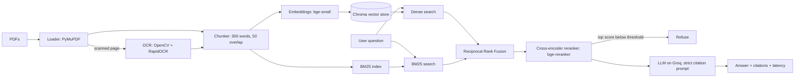

# CourseMate: citation-grounded course Q&A (RAG)

A retrieval-augmented generation system that answers questions about course material (physics textbook chapters), **cites the page for every claim**, and **refuses when the answer is not in the material**.

**Live demo:** `<your-space-url>` &nbsp;|&nbsp; **Demo video:** `<link>`

## Why this project

Generic chatbots hallucinate. For an EdTech product, a wrong answer with confident wording is worse than "I don't know." CourseMate is built around three goals:

1. **Accuracy:** retrieve the right passages (hybrid search + reranking).
2. **Trust:** every answer carries `[source, p.X]` citations, and unsupported questions are refused.
3. **Measurability:** every design choice is backed by an evaluation, not a guess.

## Architecture



| Stage | Choice | Why |
|---|---|---|
| Loading | PyMuPDF, page-level text | Keeps exact page numbers for citations |
| OCR | OpenCV deskew + RapidOCR, only if a page has <50 chars of native text | Handles scanned pages without slowing digital PDFs. Diagram labels are OCR'd too |
| Chunking | 300 words, 50 overlap, never crossing pages | Page-accurate citations, context kept across boundaries |
| Embeddings | `BAAI/bge-small-en-v1.5` (local, CPU) | Free, fast, strong retrieval quality for its size |
| Vector store | Chroma (cosine) | Zero infrastructure for a prototype |
| Keyword search | BM25 (`rank_bm25`) | Catches exact terms, symbols and names that embeddings blur |
| Fusion | Reciprocal Rank Fusion (k=60) | Combines rankings without needing comparable scores |
| Reranking | `BAAI/bge-reranker-base` cross-encoder on top 20 | Reads question and passage together, far more precise than embeddings alone |
| Guardrail | Refuse if best rerank score (sigmoid) < threshold | Blocks off-topic questions before the LLM sees them |
| Generation | Llama 3.3 70B on Groq, temperature 0 | Low latency, low cost |
| Serving | FastAPI, in-memory cache, rate limiting, Docker | Simple and deployable |

## Results

Golden set: **N answerable + M unanswerable** questions generated from the source chapters, then hand-verified.

### Retrieval ablation (`python -m eval.run_eval`)

| Config | Recall@5 | MRR | p95 retrieval ms |
|---|---|---|---|
| Dense only | X | X | X |
| + BM25 hybrid (RRF) | X | X | X |
| + Cross-encoder rerank | X | X | X |

### Generation quality (`python -m eval.run_gen_eval`)

| Metric | Value | Gate |
|---|---|---|
| Recall@5 | X | ≥ 0.80 |
| Faithfulness (LLM judge) | X | ≥ 0.85 |
| Answer relevance | X | n/a |
| Answers with a citation | X | ≥ 0.90 |
| Citations pointing to retrieved pages | X | ≥ 0.90 |
| Refusal accuracy (unanswerable) | X | ≥ 0.80 |
| False refusal rate (answerable) | X | ≤ 0.15 |
| p95 end-to-end latency | X ms | n/a |
| Cost per 100 queries | $X | n/a |

`run_gen_eval` exits non-zero when a gate fails, so it can be used as a release check.

> Faithfulness and relevance use an LLM as judge on a small set, so treat them as approximate.

### What I learned

- _(1-3 findings from your own runs, e.g. "hybrid search raised recall@5 from X to Y because physics questions contain exact terms like 'impulse'")_
- _(e.g. "the refusal threshold trades false refusals against hallucinations; I tuned it on the unanswerable set")_

## Run locally

Requires Python 3.10+ and [uv](https://docs.astral.sh/uv/).

```bash
uv sync
cp .env.example .env            # add GROQ_API_KEY
# place PDFs in data/raw/
uv run python -m app.ingest
uv run uvicorn app.main:app --reload
```

Open http://localhost:8000 for the UI or http://localhost:8000/docs for the API.

### Evaluate

```bash
uv run python -m eval.make_golden      # drafts questions; edit eval/golden.json by hand
uv run python -m eval.run_eval         # retrieval ablation
uv run python -m eval.run_gen_eval     # generation metrics + gates
```

### Configuration (`.env`)

| Variable | Default | Purpose |
|---|---|---|
| `GROQ_API_KEY` | none | LLM access |
| `LLM_PROVIDER` / `LLM_MODEL` | `groq` / `llama-3.3-70b-versatile` | Model choice (Anthropic and OpenAI also supported) |
| `REFUSE_THRESHOLD` | `0.30` | Minimum rerank score to answer |
| `OCR_LANG`, `OCR_FIGURES` | `eng`, `1` | OCR behaviour |
| `RATE_PER_MIN` | `20` | Per-IP rate limit |

## API

| Endpoint | Purpose |
|---|---|
| `POST /ask` | `{question, source?, k?}` returns answer, citations, latency, tokens |
| `GET /sources` | Available documents for filtering |
| `POST /feedback` | Thumbs up/down, logged for later review |
| `GET /health` | Liveness and chunk count |

## Project structure

```
app/        ingest, ocr, chunking, fusion, retrieval, generate, main (FastAPI)
eval/       golden set generator, retrieval eval, generation eval
static/     single-page frontend
tests/      unit tests (chunking, RRF)
Dockerfile  builds the index into the image for fast startup
```

## Limitations

- Equations in PDFs can extract as garbled text; formula questions are the weakest area.
- Answers come from text only; diagram content is limited to OCR'd labels.
- The cache and feedback log are in-process/local files, so they reset on restart and do not scale across instances.
- Faithfulness is judged by an LLM on a small golden set.

## Next steps

Redis semantic cache, managed vector DB with native hybrid search (Qdrant), streaming responses, a claim-level citation verifier, query rewriting for follow-ups, Hindi/multilingual support, tracing with Langfuse or OpenTelemetry, and running the eval in CI.
