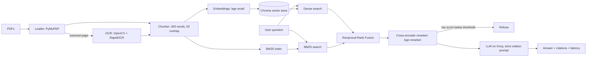

<!---
title: CourseMate
emoji: 📚
sdk: docker
app_port: 7860
--->

# CourseMate: citation-grounded course Q&A (RAG)

<<<<<<< HEAD
Hybrid retrieval (dense + BM25, RRF) -> cross-encoder rerank -> LLM answer with `[source, p.X]` citations and refusal when the material lacks the answer.

## Deployment Link : [CourseMate](https://our-bringing-assistant-highlight.trycloudflare.com/) (temporary)

## Quickstart
```bash
python -m venv .venv && source .venv/bin/activate
pip install -r requirements.txt
cp .env.example .env            # add your API key
# put 1-2 PDFs in data/raw/ (OpenStax / NCERT chapter)
python -m app.ingest
uvicorn app.main:app --reload
curl -X POST localhost:8000/ask -H 'content-type: application/json' \
  -d '{"question":"What is ...?"}'
```

## Evaluate
Copy `eval/golden.example.json` to `eval/golden.json`, write 20-30 questions (5-10 unanswerable), then:
```bash
python -m eval.run_eval eval/golden.json
```
Paste the table below. Tune `REFUSE_THRESHOLD` in `.env` using the unanswerable set.

## Results
(in `golden.json` file )

## Next steps
See PRODUCTION.md.
=======
A retrieval-augmented generation system that answers questions about course material (physics textbook chapters), **cites the page for every claim**, and **refuses when the answer is not in the material**.

**Live demo:** `<your-space-url>` &nbsp;|&nbsp; **Demo video:** `<link>`

## Why this project

Generic chatbots hallucinate. For an EdTech product, a wrong answer with confident wording is worse than "I don't know." CourseMate is built around three goals:

1. **Accuracy:** retrieve the right passages (hybrid search + reranking).
2. **Trust:** every answer carries `[source, p.X]` citations, and unsupported questions are refused.
3. **Measurability:** every design choice is backed by an evaluation, not a guess.

## Architecture



| Stage | Choice | Why |
|---|---|---|
| Loading | PyMuPDF, page-level text | Keeps exact page numbers for citations |
| OCR | OpenCV deskew + RapidOCR, only if a page has <50 chars of native text | Handles scanned pages without slowing digital PDFs. Diagram labels are OCR'd too |
| Chunking | 300 words, 50 overlap, never crossing pages | Page-accurate citations, context kept across boundaries |
| Embeddings | `BAAI/bge-small-en-v1.5` (local, CPU) | Free, fast, strong retrieval quality for its size |
| Vector store | Chroma (cosine) | Zero infrastructure for a prototype |
| Keyword search | BM25 (`rank_bm25`) | Catches exact terms, symbols and names that embeddings blur |
| Fusion | Reciprocal Rank Fusion (k=60) | Combines rankings without needing comparable scores |
| Reranking | `BAAI/bge-reranker-base` cross-encoder on top 20 | Reads question and passage together, far more precise than embeddings alone |
| Guardrail | Refuse if best rerank score (sigmoid) < threshold | Blocks off-topic questions before the LLM sees them |
| Generation | Llama 3.3 70B on Groq, temperature 0 | Low latency, low cost |
| Serving | FastAPI, in-memory cache, rate limiting, Docker | Simple and deployable |

## Results

Golden set: **N answerable + M unanswerable** questions generated from the source chapters, then hand-verified.

### Retrieval ablation (`python -m eval.run_eval`)

| Config | Recall@5 | MRR | p95 retrieval ms | 
|---|---|---|---|
| dense | 0.91 | 0.77 | 65 | 
| hybrid | 0.91 | 0.75 | 52 | 
| rerank | 0.88 | 0.66 | 750 |

### Generation quality (`python -m eval.run_gen_eval`)

| Metric | Value | Gate | 
|---|---|---|
| recall@5 | 0.94 | >= 0.8 | 
| faithfulness | 1.00 | >= 0.85 | 
| answer_relevance | 0.99 | n/a | 
| cited_rate | 1.00 | >= 0.9 | 
| citation_valid | 0.97 | >= 0.9 | 
| refusal_acc | 1.00 | >= 0.8 | 
| false_refusal | 0.00 | <= 0.15 | 
| p95 latency (ms) | 39627 | n/a | 
| cost / 100 queries (USD) | 0.1343 | n/a | 


> Faithfulness and relevance use an LLM as judge on a small set, so treat them as approximate.

### What I learned

- Hybrid search did not beat dense-only on my golden set. Recall@5 was 0.91 for both, and MRR dipped slightly (0.77 to 0.75). My questions were generated from the passages, so they share a lot of vocabulary with them and the embedding model already does well. I'd expect BM25 to matter more for symbol-heavy or exact-term queries, and I'd need a harder test set to show that.
- The reranker is an accuracy versus latency trade-off, and the model choice mattered a lot. With bge-reranker-base on CPU, retrieval p95 was about 34 s, and even after truncating inputs and reranking fewer candidates it was about 10 s. Switching to a much smaller MiniLM cross-encoder brought it to about 0.75 s, but recall@5 fell from 0.94 to 0.88 and MRR from 0.70 to 0.66, so I gave up some accuracy for speed. I'd use the larger model on a GPU or a hosted reranking API.
- The refusal threshold has to be tuned per reranker. With the first setup, the score threshold blocked 0 of 6 unanswerable questions and the prompt was doing the refusing. After I checked the score distributions, answerable questions scored at least 0.76 and unanswerable ones scored 0.00, so a threshold of 0.3 blocks all 6 off-topic questions before the LLM is called, with no false refusals on the answerable set. The test is easy because the unanswerable questions were all far from the subject, so I'd add harder near-topic cases.
- My evaluation has limits. The golden set is small and derived from the same text it tests, and the LLM judge is noisy, so I treat the metrics as directional. Perfect-looking faithfulness scores made me more suspicious of the test, not less.

## Run locally

Requires Python 3.10+ and [uv](https://docs.astral.sh/uv/).

```bash
uv sync
cp .env.example .env            # add GROQ_API_KEY
# place PDFs in data/raw/
uv run python -m app.ingest
uv run uvicorn app.main:app --reload
```

Open http://localhost:8000 for the UI or http://localhost:8000/docs for the API.

### Evaluate

```bash
uv run python -m eval.make_golden      # drafts questions; edit eval/golden.json by hand
uv run python -m eval.run_eval         # retrieval ablation
uv run python -m eval.run_gen_eval     # generation metrics + gates
```

### Configuration (`.env`)

| Variable | Default | Purpose |
|---|---|---|
| `GROQ_API_KEY` | none | LLM access |
| `LLM_PROVIDER` / `LLM_MODEL` | `groq` / `llama-3.3-70b-versatile` | Model choice (Anthropic and OpenAI also supported) |
| `REFUSE_THRESHOLD` | `0.30` | Minimum rerank score to answer |
| `OCR_LANG`, `OCR_FIGURES` | `eng`, `1` | OCR behaviour |
| `RATE_PER_MIN` | `20` | Per-IP rate limit |

## API

| Endpoint | Purpose |
|---|---|
| `POST /ask` | `{question, source?, k?}` returns answer, citations, latency, tokens |
| `GET /sources` | Available documents for filtering |
| `POST /feedback` | Thumbs up/down, logged for later review |
| `GET /health` | Liveness and chunk count |

## Project structure

```
app/        ingest, ocr, chunking, fusion, retrieval, generate, main (FastAPI)
eval/       golden set generator, retrieval eval, generation eval
static/     single-page frontend
tests/      unit tests (chunking, RRF)
Dockerfile  builds the index into the image for fast startup
```
## Screenshots


## Limitations
- Equations in PDFs often extract badly.
- Diagrams are only understood through their text labels.
- The test set is small, and an AI judging AI is a bit noisy.
- The corpus is fixed, so I could measure quality. Next step is user uploads with separate indexes per user.
- The cache and feedback reset on restart; production needs Redis and a database.
- I couldn't host it on Hugging Face's free tier, so I demo it locally. The Dockerfile works on any container host.

## Next steps

Redis semantic cache, managed vector DB with native hybrid search (Qdrant), streaming responses, a claim-level citation verifier, query rewriting for follow-ups, Hindi/multilingual support, tracing with Langfuse or OpenTelemetry, and running the eval in CI.
>>>>>>> 118b6ca0ec87974c0e1c1b6c12f815c6e08ea0f9
